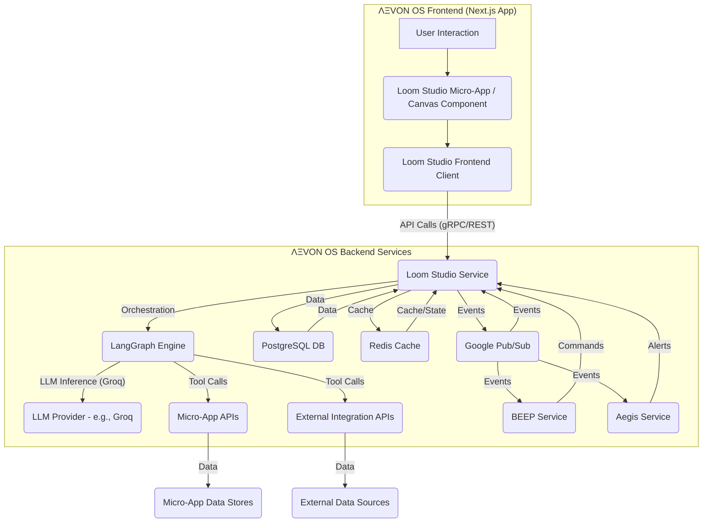

# ΛΞVON OS: Loom Studio - Architecture
1. Introduction: The Blueprint of Intelligence
Loom Studio is a native, privileged orchestration layer within ΛΞVON OS, serving as the central creative, debugging, and agent orchestration workspace. Its architecture is designed for stateful, reactive, and introspective capabilities, enabling users to visually construct, layer, and interconnect prompt blocks, scripts, and workflows. This document details the internal components and their interactions that bring Loom Studio to life.
2. Overall Architecture: A Hybrid Orchestrator
Loom Studio operates as a hybrid system, combining robust frontend visualization with powerful backend orchestration services. It leverages ΛΞVON OS's microservices architecture and AI core components.

3. Component Deep Dive
3.1. Frontend Components (LoomStudioUI & LoomStudioClient)
LoomStudioUI (React Component):
Description: The primary user interface of Loom Studio, rendered within the ΛΞVON OS Canvas. It is a complex React component that manages the visual representation of workflows, nodes, and panels.
Key Features:
Agent Orchestration Canvas: Renders the drag-and-drop visual workspace for constructing workflows.
Modular Panels: Manages the display, positioning (drag/resize/pin/stack), and content of panels like the "Palette," "Inspector," "Timeline," and "Console."
Real-time Visualization: Displays live updates of workflow execution, agent states, and debugging traces.
Styling: Adheres strictly to the "Ancient Roman Glass" aesthetic, utilizing Glassmorphism, the triadic color palette, and Comfortaa/Lexend typography.
LoomStudioClient (Frontend Service Layer):
Description: A client-side service layer (TypeScript) that handles all communication between the LoomStudioUI and the LoomStudioService backend.
Communication: Uses standard API calls (REST/gRPC) to interact with the backend.
State Management: Manages client-side UI state using Zustand, synchronizing with backend data.
3.2. Backend Services (LoomStudioService)
Description: The core backend microservice for Loom Studio, responsible for workflow persistence, agent orchestration logic, and managing interactions with other OS components. Likely implemented as a Node.js/TypeScript service.
Key Responsibilities:
Workflow Persistence: Stores and retrieves workflow definitions (LangGraph JSONB) from the PostgreSQL database. Manages workflow versioning.
Agent Lifecycle Management: Handles the spawning, pausing, resuming, and termination of AI agent instances, delegating execution to the LangGraph Engine.
Debugging Data Collection: Ingests real-time telemetry from running LangGraph instances (events, states, token usage) and stores it for debugging and observability features.
API Exposure: Exposes internal APIs for the Loom Studio frontend and external APIs for privileged system interactions (e.g., BEEP scaffolding workflows).
Event Handling: Listens for relevant events from the Google Pub/Sub Message Bus (e.g., agent.completed, workflow.failed) to update UI states and trigger internal logic.
3.3. AI Orchestration Core (LangGraph Engine)
Description: The core framework for defining and executing stateful, multi-step agentic applications and complex AI-driven workflows. It is the "head chef" for agent orchestration.
Implementation: LangGraph instances are dynamically created and managed by the LoomStudioService (or a dedicated Workflow Execution Service).
Key Functions:
Workflow Execution: Executes the defined LangGraph workflows, managing state transitions, tool usage, and LLM calls.
Agent Coordination: Orchestrates communication and collaboration between multiple AI agents within a workflow (CrewAI integration).
Tool Invocation: Calls external tools, Micro-App APIs, and other internal ΛΞVON OS services as defined in the workflow.
LLM Integration: Configured to use Groq as its core LLM provider for instantaneous inference, ensuring real-time agent decision-making and rapid workflow execution.
3.4. Data Persistence & Caching
PostgreSQL Database:
Purpose: Stores all persistent data for Loom Studio, including workflow_definitions (as JSONB), workflow_runs (execution history), and debugging telemetry (e.g., event_logs, behavioral_snapshots).
ORM: Prisma is used by the LoomStudioService for type-safe database interactions.
Redis Cache (Upstash Redis):
Purpose: Used for high-speed caching of frequently accessed data and for managing the transient state of active agent sessions and workflow runs. This minimizes database load and improves responsiveness.
4. Integration with Core ΛΞVON OS Subsystems
Loom Studio is deeply integrated with the ΛΞVON OS ecosystem, acting as a central nexus.
BEEP (Behavioral Event & Execution Processor):
Workflow Scaffolding: BEEP sends natural language requests to LoomStudioService to generate initial workflow drafts in the visual editor.
Contextual Guidance: BEEP provides real-time, personalized suggestions within Loom Studio based on the user's workflow design and Psyche-Matrix profile.
Agent Persona Modulation: BEEP's persona (Trinity of BEEP) can be influenced by the active Micro-App context within Loom Studio.
Aegis (Cybersecurity Fabric):
Security-Driven Flows: Loom Studio allows for the design of SOAR (Security Orchestration, Automation, and Response) playbooks, where security incidents (detected by Aegis) can trigger automated workflows.
Agent Governance: Aegis monitors agent behavior within Loom Studio workflows, flagging anomalies and enforcing capability limits.
Data Integrity: Loom Studio's data (workflow definitions, execution logs) is protected by Aegis's Data Integrity Protocol.
Micro-Apps:
Tooling: Micro-Apps serve as callable "tools" or "nodes" within LangGraph workflows designed in Loom Studio.
Interaction: Loom Studio can spawn or modify agent flows within Micro-Apps.
KLEPSYDRA Engine:
Fate Loom Visualization: Loom Studio provides the "Fate Loom" dashboard for internal ops and elite devs, visualizing system-wide economic pulse, Φ accumulation, and economic anomalies.
Profit Dials: Exposes "Profit Dials" for administrators to tune the economic engine.
Folly Instrument Design: Facilitates the design and integration of new Folly Instruments and their probabilistic outcomes.
5. Development Directives
Modularity: Ensure clear separation of concerns between frontend UI, backend service logic, and LangGraph definitions.
Performance: Optimize for fluid visual interactions and real-time data updates, especially for debugging traces and live observability.
Scalability: Design backend services and LangGraph instances for horizontal scalability to handle numerous concurrent workflows and agents.
Security: Adhere strictly to Aegis protocols for agent governance, data integrity, and access control.
Observability: Implement comprehensive logging and telemetry for all workflow execution and agent behavior, feeding into Loom Studio's debugging features.

    