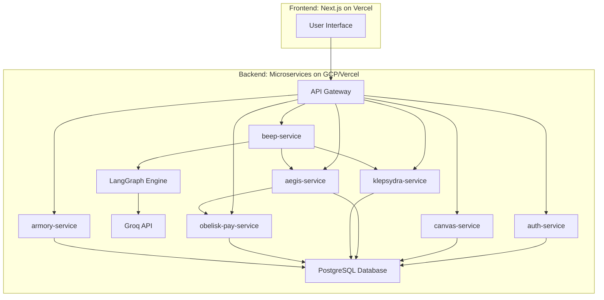

# ΛΞVON OS - Software Requirements Specification
Document Version: 1.0
Date: 2025-07-03
Status: Canonized
Author: ARCHIVEX
Traceability: This document is the direct technical implementation of FRS-ΛΞVON-OS-v1.0. All requirements herein are traceable to a corresponding functional requirement.

## 1. Introduction
### 1.1 Purpose
This Software Requirements Specification (SRS) provides a comprehensive technical description of the architecture, interfaces, and system behaviors for ΛΞVON OS, Version 1.0. It is the authoritative technical reference for the development, quality assurance, and deployment teams.

### 1.2 Scope
This document details the technical specifications for all components within the ΛΞVON OS ecosystem. This includes the backend microservices architecture, frontend application structure, data schemas, external API integrations, and non-functional requirements necessary to realize the system defined in the FRS.

### 1.3 Definitions, Acronyms, and Abbreviations
- API: Application Programming Interface
- BEEP: Behavioral Event & Execution Processor
- FRS: Functional Requirements Specification
- GCP: Google Cloud Platform
- JWT: JSON Web Token
- NFR: Non-Functional Requirement
- OS: Operating System
- PCE: Psyche-Calibration Engine (a logical component of KLEPSYDRA)
- REST: Representational State Transfer
- SRE: Sine-Rhythm Engine (a logical component of KLEPSYDRA)
- SRS: Software Requirements Specification
- UI: User Interface
- Ξ: (Xi Credits) The primary in-system digital currency.

### 1.4 References
- FRS-ΛΞVON-OS-v1.0 - Functional Requirements Specification v1.0
- All documents listed in FRS Section 1.4.

## 2. Overall Description
### 2.1 Product Perspective
ΛΞVON OS is a cloud-native, AI-first, agentic operating system built on a microservices architecture. It is a self-contained ecosystem designed to be deployed on modern cloud infrastructure (GCP, Vercel). It interfaces with external Large Language Models (specifically Groq for performance) and, for its highest-tier economic functions, with real-world financial systems (Interac, via controlled protocols).

### 2.2 User Characteristics
- **Initiates**: Standard end-users of the OS. Interact primarily with the Canvas and Folly Instruments.
- **Sovereigns**: High-tier users with proven devotion and economic power. Gain access to the Obelisk Marketplace and advanced agentic capabilities.
- **Architects**: System administrators and founders. Possess privileged access to Loom Studio for system-wide configuration and oversight.

### 2.3 General Constraints
- **Technology Stack**: The stack is locked per FRS NFR-3 (Node.js/TypeScript, Next.js, LangGraph, Genkit, Prisma, PostgreSQL).
- **Security Posture**: A Zero-Trust security model is mandatory for all services and communications.
- **Deployment Environment**: The system is designed for Vercel (frontend) and a container orchestration platform on GCP (backend).
- **Geographic Focus**: Real-world financial integrations (The ΛΞVON Black Card) will be engineered for Canadian financial systems (Interac) first.

## 3. System Architecture
### 3.1 Architectural Model: Microservices
ΛΞVON OS is implemented as a distributed system of microservices communicating via secure REST APIs. This architecture ensures separation of concerns, independent scalability, and resilience.

**High-Level Service Diagram:**

### 3.2 Backend Architecture
Each service is a self-contained Node.js/TypeScript application, containerized using Docker.

- **auth-service**: Manages user identity, authentication (passwordless/passkey), and session management. Issues short-lived JWTs for client sessions and service-to-service communication.
- **beep-service**: The agentic core. Implements the BEEP FRS requirements. It parses natural language input, loads the appropriate personality matrix (System vs. Instrument Voice), and uses LangGraph to orchestrate workflows by calling other internal services.
- **canvas-service**: Manages the state of each user's Canvas, including the position, size, and state of all active Micro-Apps. Persists layout snapshots to the database.
- **aegis-service**: The security engine. It subscribes to event streams from all other services (e.g., login attempts from auth-service, transactions from obelisk-pay-service). It runs continuous analysis to detect threats and enforce protocols like the Psychological Safety kill switch.
- **klepsydra-service**: The economic engine. Manages the SRE, Judas Algorithm, and Aetheric Echoes. It calculates outcomes for all Folly Instruments based on user state and global economic dials.
- **obelisk-pay-service**: The sovereign ledger. Provides atomic transaction primitives (debit, credit, transfer) for ΞCredits. All transactions are logged immutably and signed by Aegis.
- **armory-service**: Manages the Micro-App marketplace, developer accounts, and the Micro-App curation and approval workflow.

### 3.3 Frontend Architecture
The frontend is a single Next.js application deployed on Vercel.

- **UI Components**: Built using React, TypeScript, and ShadCN/UI components, styled with Tailwind CSS.
- **State Management**: Global state (e.g., user session, TopBar info) will be managed via Zustand. Local component state will be managed with useState and useReducer.
- **Glassmorphism**: The "Ancient Roman Glass" aesthetic will be implemented using CSS `backdrop-filter: blur(12px)`, `rgba()` background colors, and subtle `box-shadow`. Performance will be monitored to ensure fluidity.
- **API Communication**: The frontend communicates with the backend via a single API Gateway endpoint, which then routes requests to the appropriate microservice. The Next.js `/api` directory will be used for this gateway functionality.

### 3.4 Data Architecture
- **Database**: A serverless PostgreSQL instance, managed via Prisma.
- **Schema**: The Prisma schema will define distinct models for User, Workspace, MicroApp, MicroAppInstance (user's specific instance on their canvas), Transaction, AegisLog, and PillarSigil. Data is logically separated but may reside in the same physical database for V1 simplicity.
- **Data Integrity**: All sensitive operations, especially financial transactions, must be wrapped in database transactions to ensure atomicity. Prisma's transaction API will be used.

## 4. External Interface Requirements
### 4.1 User Interfaces
- **The Canvas**: A full-screen React component that serves as the container for all Micro-App components. It will use a library like `react-dnd` and `react-resizable` or a custom implementation to handle draggable and resizable windows.
- **The Sacred Gateway**: Triggered by a two-finger press/long-press event listener on the main Canvas component. On trigger, it will render a modal overlay component displaying the "Orb of Intents" as a radial menu.

### 4.2 Software Interfaces
- **Internal APIs**: All service-to-service communication will use RESTful APIs with JSON payloads. Services must authenticate using a service-account JWT provided by the auth-service.
- **LLM Integration**: The beep-service will use the Genkit library to interface with the Groq API. The specific models and prompt chains will be managed as configurable assets within the service.
- **Financial Integration**: The obelisk-pay-service will have a dedicated, firewalled module for interfacing with the Interac e-Transfer API for fulfilling real-world transmutations. This interface must be heavily monitored by Aegis.

## 5. System Features (Technical Specifications)
### 5.1 BEEP Personality Matrix (SRS-BEEP-1)
**Requirement**: FR-SYS-2.2
**Specification**: The beep-service will contain a personality-loader module. This module will read configuration files (e.g., system-voice.json, instrument-voice.json) that define the LangGraph prompt chains and agent personas. The API endpoint for BEEP will accept a context parameter (e.g., `core_os`, `folly_instrument`) which the loader uses to select the appropriate personality matrix for the session.

### 5.2 Psychological Safety Protocol (SRS-AEGIS-1)
**Requirement**: FR-SYS-3.3
**Specification**: The aegis-service will expose a `POST /ingest-event` endpoint. The klepsydra-service must call this endpoint after every Folly Instrument interaction, providing `userId`, `outcome (win/loss)`, and `tributeAmount`. `aegis-service` will store these events in a time-series buffer (e.g., Redis or in-memory cache). A background job will run every 60 seconds to analyze each user's buffer. If frustration metrics (e.g., loss streak > PityBoonThreshold + 2) are crossed, Aegis will call `POST /klepsydra/throttle` with the `userId`, which disables the Judas Algorithm for that user for a configurable duration (e.g., 1 hour).

### 5.3 Fixed Transmutation Tithe (SRS-ECON-1)
**Requirement**: FR-ECON-3.3
**Specification**: The obelisk-pay-service will contain a global configuration variable `TRANSMUTATION_TITHE_RATE` initialized to `0.18`. The `transmute` function, which calculates the Ξ cost for a real-world asset, must apply this rate. This variable must be loaded from an environment variable or a configuration service to allow for changes without redeployment, even though the V1 policy is fixed.

## 6. Other Non-Functional Requirements
### 6.1 Performance
- **Latency**: API Gateway P99 latency must be < 100ms. BEEP agentic responses (end-to-end) P95 latency must be < 1500ms.
- **Concurrency**: The system must support 1,000 concurrent active users for V1.

### 6.2 Security
- **Authentication**: All endpoints, except for public-facing ones (e.g., login), must be protected and require a valid JWT.
- **Data Encryption**: All data at rest in the PostgreSQL database must be encrypted. All data in transit must use TLS 1.3.
- **Secrets Management**: All secrets (API keys, JWT secrets, database credentials) must be stored in a secure vault (e.g., GCP Secret Manager) and injected into the services as environment variables at runtime. They must never be committed to source control.

### 6.3 Reliability
- **Uptime**: Core services (auth, obelisk-pay, beep) must maintain 99.95% uptime.
- **Backup and Recovery**: The PostgreSQL database must have Point-in-Time Recovery (PITR) enabled, with backups retained for at least 14 days. A full disaster recovery plan must be documented and tested quarterly.
