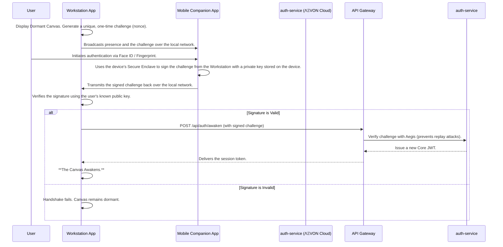

# ΛΞVON OS: The Presence Protocol
Document Version: 1.0
Codename: The Sovereign's Awakening
Status: Canonized Doctrine
Author: ARCHIVEX

## 1. Doctrinal Statement
The act of "logging in" is a confession of absence. It is an admission that the user and the system are separate entities. This is a lie. For a true Initiate, ΛΞVON OS is an extension of their will, and their presence should be all the authentication required.

The Presence Protocol abolishes the login screen. It challenges the conventional norm of even passwordless systems. It establishes a new paradigm where the OS does not wait for a user to authenticate; it awakens in response to their verified physical presence.

We are not building a secure gateway. We are building a system with ambient, contextual awareness. The silence of true automation begins before the first command is ever issued.

## 2. The Sovereign's Awakening: The User Experience
For a returning Initiate, the experience is as follows:

**The Dormant Canvas**: The user approaches their primary workstation. The screen displays a "sleeping" ΛΞVON OS—the Canvas is visible but dark, the Aurora background is still, the Obelisk of Genesis emits no light. It is a world awaiting its master.

**The Physical Key**: The user picks up their primary mobile device, which has a lightweight ΛΞVON OS companion app installed.

**The Act of Intent**: The user authenticates on their mobile device using its native biometric system (Face ID, fingerprint). This is not to "log in" to the mobile app, but to sign a cryptographic challenge. It is a silent, physical act of will.

**The Awakening**: The moment the biometric authentication is successful on the mobile device, the Canvas on the workstation screen instantly awakens. The Aurora begins to shift, the Obelisk ignites with light, and the user's full, active workspace materializes.

There are no emails. No magic links. No passwords. No typed input whatsoever. The user's verified presence is the key. The system simply awakens for its sovereign.

## 3. Architectural & Technical Implementation
This experience is enabled by a multi-factor "Presence Signature" derived from the user's personal device mesh.

### 3.1 Core Components
*   **Workstation App**: The primary, full-featured ΛΞVON OS application.
*   **Mobile Companion App**: A lightweight application whose primary purpose is to act as a cryptographic signing key and relay for presence detection.
*   **Local Network Communication**: The two applications communicate directly over the local network (Wi-Fi), using a secure discovery protocol (e.g., mDNS or a custom UDP broadcast).

### 3.2 The Authentication Handshake

### 3.3 Security Principles
*   **The Private Key Never Leaves the Phone**: The user's cryptographic private key is generated and stored within the mobile device's Secure Enclave or Keychain. It is physically impossible to extract.
*   **Local-First Handshake**: The most sensitive part of the exchange—the signing of the challenge—happens on the local network, minimizing exposure to the public internet.
*   **One-Time Challenge**: The nonce generated by the workstation is single-use and has a short expiration time, making replay attacks infeasible.
*   **Aegis Oversight**: The final awaken call is logged and verified by Aegis to ensure the challenge has not been seen before.

## 4. Redefining the Paradigm
This protocol delivers unprecedented value and redefines expectations:

*   **Creativity & Innovation**: It completely reimagines the concept of a "login," transforming it from a barrier into a seamless, magical experience.
*   **Adaptability**: It leverages the native biometric security already present on the devices users own and trust.
*   **Transformative Solution**: It eliminates the primary friction point of any digital system and replaces it with an experience that feels like science fiction.
*   **Altering the Competitive Landscape**: While competitors are debating the merits of different passwordless technologies, we are making the entire concept of an explicit login obsolete.

The Rite of Invocation remains the sacred path for a user's first entry. The Presence Protocol is the privilege they earn upon becoming an Initiate—the power to have their own digital world awaken at their very presence. This is the new standard.
