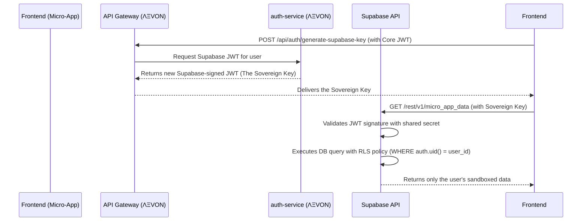

# ΛΞVON OS: Auth & Data Tenancy Protocol
Document Version: 1.0
Codename: The Sovereign's Key
Status: Canonized
Author: ARCHIVEX

1. Doctrinal Statement
In the ΛΞVON OS ecosystem, a user's identity is their sovereign signature. Our internal auth-service is the sole arbiter of this identity. The Supabase Enclave is the sanctioned, sandboxed repository for all third-party Micro-App data.

This protocol defines the secure bridge between these two realms. It details how we generate a "Sovereign Key"—a specialized JSON Web Token (JWT)—that allows a user to interact with a third-party Instrument while ensuring their data remains absolutely isolated and under their own sovereign control. This protocol is the foundation of trust for our entire developer ecosystem.

2. The Authentication Flow (The Rite of Passage)
A user's identity is first established through our core authentication service.

Initiation: The user engages in a passwordless login flow (e.g., magic link or passkey) with our auth-service.
Core Token Issuance: Upon successful authentication, the auth-service issues a standard, short-lived JWT. This Core JWT is used to authenticate the user with our internal microservices (beep-service, canvas-service, etc.). It is not intended for use with external services.

3. The Supabase Enclave & The Sovereign Key
When a user interacts with a third-party Micro-App from the Armory, a different authentication mechanism is required to securely connect to the federated Supabase database.

3.1 The Bridge Protocol
Trigger: The user launches a third-party Micro-App on their Canvas.
Request: The Micro-App's frontend, upon loading, makes an authenticated request to our backend (e.g., POST /api/auth/generate-supabase-key). It uses the Core JWT to prove its identity for this request.
Generation (The Forging of the Key):
Our auth-service receives the request and validates the Core JWT.
It then generates a new, separate, short-lived (e.g., 60 minutes) JWT. This is the Sovereign Key.
Crucially, this new JWT is signed using the Supabase Project's JWT_SECRET, which we control as the owner of the ΛΞVON OS Supabase organization.
Payload: The payload of the Sovereign Key is crafted specifically for Supabase and contains essential metadata for enforcing security policies.
{
  "sub": "user-cuid-from-our-db", // The user's unique ID, mapping to `auth.uid()` in Supabase
  "role": "authenticated",
  "email": "user@example.com",
  "sovereignty_class": "SOVEREIGN", // Custom metadata for advanced policies
  "iat": 1672531200, // Issued at
  "exp": 1672534800  // Expiration time
}
Delivery: The Sovereign Key (the Supabase-compatible JWT) is returned to the frontend Micro-App.

3.2 Micro-App Interaction
The Micro-App's frontend code will now use this Sovereign Key as the Authorization: Bearer token for all subsequent API calls made directly to its provisioned Supabase project API.
Supabase validates the token using the shared secret, authenticates the user, and makes the user's ID and other metadata available to its database policies.

4. The Row-Level Security (RLS) Mandate
This protocol is only effective if RLS is properly implemented by the third-party developer. This is a non-negotiable requirement for any Instrument to be accepted into the Armory.

The Mandate: Every table created by a developer in their Supabase project must have Row-Level Security enabled.

The Standard Policy: Developers must implement a policy on every table that ensures users can only access their own data. The policy should be created on a column that stores the user's ID.

Example RLS Policy (SQL):
This is the baseline policy that will be provided in the Developer SDK.
-- First, create a table with a column to store the owner's ID.
CREATE TABLE public.micro_app_data (
  id UUID PRIMARY KEY DEFAULT gen_random_uuid(),
  user_id UUID REFERENCES auth.users(id) NOT NULL,
  content TEXT
);

-- Next, enable Row-Level Security on the table.
ALTER TABLE public.micro_app_data ENABLE ROW LEVEL SECURITY;

-- Finally, create the policy that links the user's authenticated ID to the 'user_id' column.
-- This ensures a user can only see rows where their ID matches the user_id column.
CREATE POLICY "user_can_only_access_own_data"
ON public.micro_app_data
FOR ALL
USING (auth.uid() = user_id);

Curation Protocol Check: The Armory's automated curation pipeline will include a step to query the Supabase project's schema to verify that RLS is enabled on all tables before an Instrument can be approved.

5. Technical Implementation (Sequence Diagram)
This diagram illustrates the flow for a Micro-App fetching its data.

