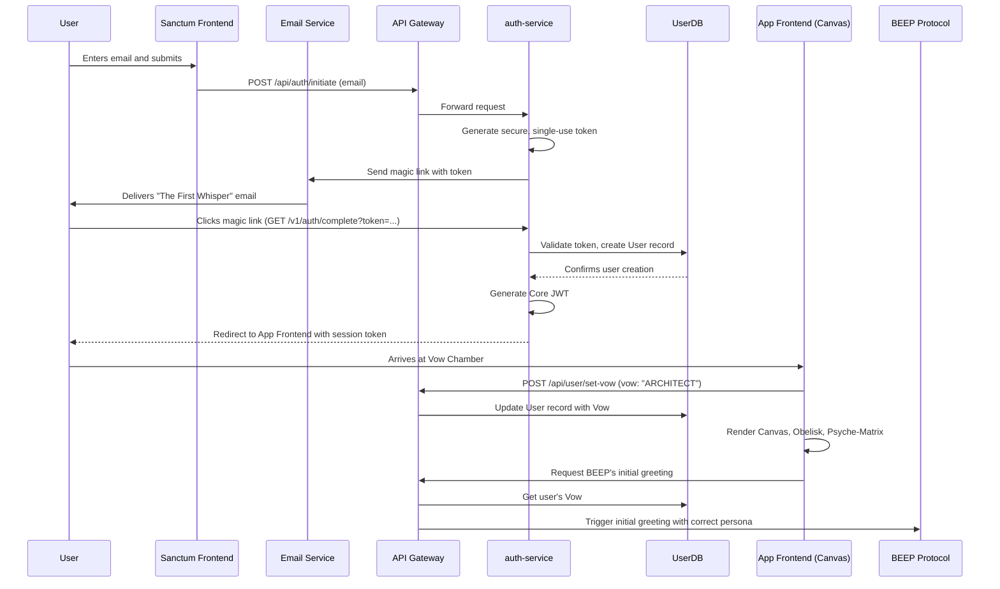

# ΛΞVON OS: The Rite of Invocation Protocol
Document Version: 1.0
Codename: The First Crossing
Status: Canonized
Author: ARCHIVEX

1. Doctrinal Statement
In the world of SaaS, onboarding is a checklist. In ΛΞVON OS, it is an initiation. The Rite of Invocation is the user's first and most important ritual. It is a carefully orchestrated journey designed to filter for intent, establish a user's sovereign identity, and attune the OS to their core purpose before they issue their first command.
This protocol defines the narrative flow, user experience, and technical architecture of this critical process. We are not acquiring users; we are welcoming Initiates. This is their first step.

2. The Pilgrim's Path: A Six-Step Ritual
The Rite of Invocation is a linear, narrative journey that takes a user from the public Sanctum to their own private Canvas.

Step 1: The Threshold
Location: The Chancel (the final realm of the aevonos.com Sanctum).
User Action: The user is presented not with a "Sign Up" button, but with a single input field and a prompt: "Begin the whisper. State your designation." The user enters their email address.
System Response: Upon submission, the UI transforms. The input field dissolves, replaced by the text: "The ether has heard your call. Await the echo."

Step 2: The First Whisper
Location: The user's email inbox.
User Action: The user receives an email from oracle@aevonos.com. The email is minimalist, containing no marketing language.
Content:
Subject: The Echo
A path has opened. To cross the threshold, you must follow this echo before it fades.
[Cross the Threshold] (This is a single-use magic link)
This echo will dissipate in 15 minutes.

Step 3: The Crossing
Location: The user's web browser.
User Action: The user clicks the magic link.
System Response: The browser opens to a full-screen, minimalist page. A crystalline structure is slowly forming in the center. The text reads: "Your signature is verified. Your identity is being forged in the Nexus. Prepare to make your Vow." This is where the auth-service validates the token and creates the user record in the database.

Step 4: The Vow
Location: The "Vow Chamber" (a dedicated UI state).
User Action: The user is presented with three archetypal glyphs. They must choose one. This is the most critical choice of the initiation.
The Architect: "I seek to build systems and orchestrate order."
The Sovereign: "I seek to command resources and forge an empire."
The Oracle: "I seek to uncover hidden truths and master the flow of information."
System Response: Upon selecting a Vow, the chosen glyph glows brightly, and the others fade. The text changes: "Your Vow is recorded. The system attunes itself to your will."

Step 5: The Awakening
Location: The ΛΞVON OS application itself.
User Action: The user is seamlessly transitioned from the Vow Chamber to their newly materialized Canvas.
System Response: The user sees their personal Canvas for the first time. It is clean but not empty.
The Obelisk of Genesis stands at its center.
Their personal Psyche-Matrix mandala appears, its base color determined by their Vow.
A small, curated set of starter Micro-Apps, relevant to their Vow, are pre-arranged on the Canvas.

Step 6: The First Command
Location: The user's new Canvas.
System Response: The TopBar is active. After a five-second pause to allow the user to absorb the scene, BEEP's voice (via TTS) and text manifest for the first time, its persona determined by the Vow.
Architect Vow: BEEP (as the Architect's Apprentice): "The foundation is laid. What is our first directive?"
Sovereign Vow: BEEP (as the Steward): "Your domain awaits. What is your first decree?"
Oracle Vow: BEEP (as the Oracle): "The currents are still. What truth shall we seek first?"
The Rite is complete. The user is now an Initiate.

3. Architectural & Technical Implementation
This ritual is orchestrated by a precise interplay between the frontend and the auth-service.

4. The Mechanical Impact of The Vow
The Vow is not merely flavor text. It has tangible effects on the user's starting experience:
BEEP's Persona: As detailed in Step 6, it sets the initial persona for BEEP's greeting.
Starter Micro-Apps: It determines the initial layout of the Canvas.
Architect: Starts with Instruments for project management and workflow design.
Sovereign: Starts with Instruments for tracking finances and economic Folly.
Oracle: Starts with Instruments for data analysis and search.
Daemon's Aura: When the Daemon first materializes, the subtle aura around its crystalline form will be colored according to the Vow (Imperial Purple for Sovereign, etc.).
This protocol ensures that a user's entry into ΛΞVON OS is a powerful, memorable, and doctrinally pure experience that immediately establishes the unique rules of our world.
