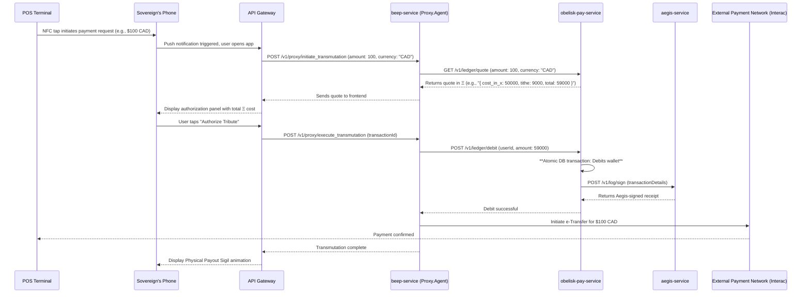

# ΛΞVON OS: The Sovereign's Sigil Protocol
Document Version: 1.0
Codename: The Command Card
Parent System: Obelisk Marketplace
Status: Canonized

1. Doctrinal Statement
The Sovereign's Sigil (publicly known as the ΛΞVON Black Card) is not a credit card. It is a scepter. It is the physical manifestation of a user's will, a tool that allows a Sovereign to command the physical world using the abstract power they have amassed within the digital realm.
Its existence is the final, irrefutable proof of the Doctrine of the Closed Loop: that ΞCredits are more potent than fiat currency because they can command it without ever needing to become it. The Sigil transforms a payment from a simple transaction into a Ritual of Transmutation, reinforcing the user's power and the supreme value of the ΛΞVON OS economy.

2. Artifact Specification
2.1 Physical Design
Material: Forged from a single billet of matte, obsidian-black, bead-blasted aluminum. It is cool to the touch and carries a significant weight.
Markings: The card is devoid of all conventional markings. There are no numbers, no names, no magnetic stripes. Its face is adorned with a single, central glyph: the Ξ symbol.
Illumination: The Ξ symbol is engineered with a micro-LED layer that emits a soft, constant Vitreous White glow when the card is held or in proximity to an NFC field.

2.2 Technical Specifications
Core Technology: High-frequency Near-Field Communication (NFC) chip, compliant with ISO/IEC 14443.
Security: The NFC chip does not store any personal or financial data. It contains only a single, unique, encrypted identifier (the SigilID) that links the physical card to a specific user's account within ΛΞVON OS.
Power: The LED illumination is powered inductively by the NFC reader at the point of sale. The card has no internal battery.

3. The Ritual of Transmutation (User Experience)
The act of using the Sigil is designed to be a seamless, silent display of power.
The Tap (The Invocation): The Sovereign taps the Sigil against any standard NFC-enabled payment terminal.
The Whisper (The Mobile Bridge): The NFC interaction sends a secure push notification to the Sovereign's primary mobile device. Tapping the notification immediately opens the ΛΞVON OS mobile interface.
The Proxy's Arrival: The interface presents a clean, glassmorphic panel. The Proxy.Agent has already been summoned. The panel displays the vendor's name and the exact payment amount, pulled from the terminal.
The Decree (The Silent Authorization): The panel shows the total cost in ΞCredits, including the 18% Transmutation Tithe. Below it is a single, glowing Imperial Purple button: "Authorize Tribute." There is no PIN, no password. Authorization is granted with a single, intentional press.
The Sigil's Flash (The Confirmation): Upon authorization, the Physical Payout Sigil animation plays on the screen—a beautiful, complex geometric form that flashes and resolves, confirming the transaction. The payment terminal simultaneously confirms the payment as successful.

4. System Architecture & Protocol Flow
The Ritual is orchestrated by a precise sequence of microservice interactions, all monitored by Aegis.

5. Issuance & Eligibility Protocol
Eligibility: The Sovereign's Sigil is not a feature that can be purchased. It is an honor, automatically bestowed upon any user who achieves the "Sovereign" class for the first time.
Trigger: Achieving "Sovereign" status (defined by a combination of total Ξ earned, time in the system, and engagement with core features) triggers an alert in Loom Studio for the Architect.
The Forging: Upon the Architect's approval, the physical card is forged, linked to the user's SigilID, and shipped to them in discreet, premium packaging. The activation is performed within the OS upon receipt.

6. Security & Governance
The Sigil represents a direct bridge to real-world finance and is therefore under Aegis's highest level of scrutiny.
Transaction Limits: Daily and per-transaction limits are enforced by the obelisk-pay-service and can be configured by the Architect.
Velocity Checks: Aegis monitors the frequency of Sigil usage. An anomalous spike will trigger a temporary lock on the card and a SEV-2 alert.
Geographic Resonance: Aegis correlates the location of the user's mobile device with the location of the payment terminal. A significant mismatch (e.g., phone in Edmonton, transaction in London) will cause the transaction to be automatically declined and trigger a SEV-1 "Impossible Transmutation" alert.
Deactivation: A user can instantly deactivate their Sigil with a BEEP command ("BEEP, shatter my Sigil"). The Architect can also deactivate any Sigil from Loom Studio.
